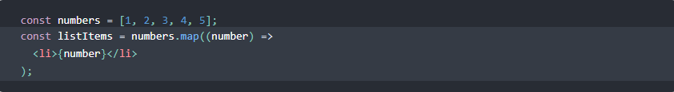
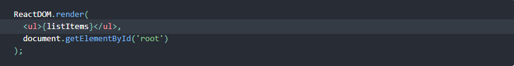
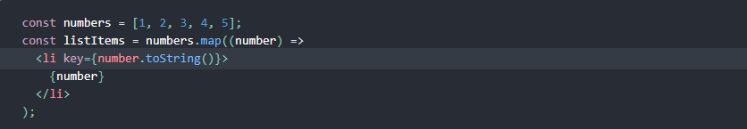
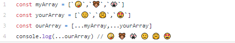
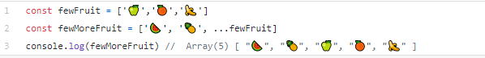
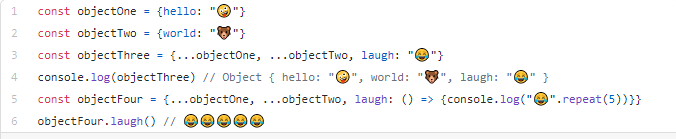
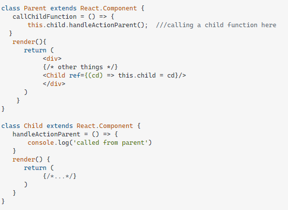

# **Passing Functions as Props**

# **Lists and keys**

## The Map object holds key-value pairs and remembers the original insertion order of the keys. Any value (both objects and primitive values) may be used as either a key or a value.
## So,A Map object iterates its elements in insertion order — a for...of loop returns an array of [key, value] for each iteration.

## **What does .map() return?**

## map() function returns a map object(which is an iterator) of the results after applying the given function to each item of a given iterable (list, tuple etc.) ....fun : It is a function to which map passes each element of given iterable.

## **If I want to loop through an array and display each value in JSX, how do I do that in React?**

## You can build collections of elements and include them in JSX using curly braces {}.and we loop through this array that we build  using the JavaScript map() function. 

## **example :**

## 1. we loop through the numbers array using the JavaScript map() function. We return a < li> element for each item. Finally, we assign the resulting array of elements to listItems:

## 2. We include the entire listItems array inside a < ul> element, and render it to the DOM:

## **Each list item needs a unique __ a key is to use a string that uniquely identifies a list item __.**

## **What is the purpose of a key?**

## Keys help React identify which items have changed, are added, or are removed. Keys should be given to the elements inside the array to give the elements a stable identity:

## **example :**

# **The Spread Operator**

## **What is the spread operator?**

## The spread operator is a useful and quick syntax for adding items to arrays, combining arrays or objects, and spreading an array out into a function’s arguments.
## in JavaScript, spread syntax refers to the use of an ellipsis of three dots (…) to expand an iterable object into the list of arguments.

## **List 4 things that the spread operator can do.**

## The … spread operator is useful for many different routine tasks in JavaScript, including the following:

## 1. Copying an array
## 2. Concatenating or combining arrays
## 3.sing Math functions
## 4.Using an array as arguments

## **Give an example of using the spread operator to combine two arrays**

## in this example, the spread operator can quickly combine two arrays, an operation known as array concatenation:

## **Give an example of using the spread operator to add a new item to an array**

## As noted in this example, the spread operator can add an item to an another array with a natural, easy-to-understand syntax:

## **Give an example of using the spread operator to combine two objects into one**

## The spread syntax is useful for combining the properties and methods on objects into a new object:

# **How to Pass Functions Between Components**

## **In the video, what is the first step that the developer does to pass functions between components?**

## Creating Functions at the State Level Components

When working with state, we typically want state to be in only 1 component. In other terms, we want the lowest number of components with state as possible. This means that in order to change state in a different component, we have to pass down our functions as props to the component that needs to change state. This way, we can have functions in our child components that are able to change state. This is very useful for cases where you have a child component that has an onClick function or an onChange function that needs to change state in order for the user to see the correct information on the screen.

## then Passing Down Functions As Props

The process of passing down functions as props can be very confusing. It happens during the render, where you call a new component. During that component call, you pass in your function as a prop. 

## **In your own words, what does the increment function do?**

 ## Increment(): It takes a variable and increments (changes) its value, and also returns this value. The increment can be a positive or negative number.

## Note:
The Increment() function changes the value of its first argument.

## **How can you pass a method from a parent component into a child component?**

## 1. parent component defines a function.
## 2. The function is passed as a prop to a child component.
## 3. The child component then invokes the prop.
## 4. parent function is then called, usually changing something.
## 5. Then the parent component is re-rendered along with its children.

## **How does the child component invoke a method that was passed to it from a parent component?**

## You can assign a ref to the child component and then call the function form parent like this example :
 

## Things I want to know more about
 
I want to know more about how i can use The … spread operator  for many different routine tasks in JavaScript

### References:
* [React Docs - lists and keys](https://reactjs.org/docs/lists-and-keys.html)
* [The Spread Operator](https://medium.com/coding-at-dawn/how-to-use-the-spread-operator-in-javascript-b9e4a8b06fab)
* [How to Pass Functions Between Components](https://www.youtube.com/watch?v=c05OL7XbwXU) 
* [React Docs - Lifting State Up](https://reactjs.org/docs/lifting-state-up.html)
